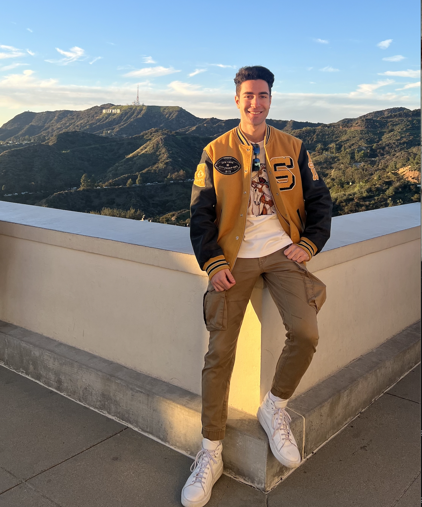
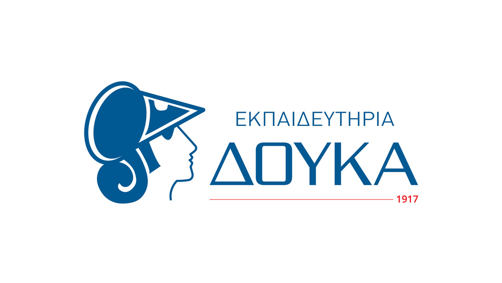

# Alexandros Karagiannis

## Statistical Analysis Portfolio

### Applied Statistics / Data Analysis & Visualization

::: {.columns valign="middle"}
::: {.column width="40%"}
::: profile-frame
[{.profile-pic}](profile.jpg)
:::
:::

::: {.column width="60%"}
I am a 4th year student at the University of Toronto Scarborough studying Applied Statistics, Economics, and Politics, with a strong interest in data science and the application of statistical thinking to real-world questions.

This portfolio brings together selected academic and analytical work in order to show both my technical skills and my broader interest in using quantitative methods to interpret data carefully, identify meaningful patterns, and draw well-grounded conclusions.

> **Ζητεῖν τὴν ἀλήθειαν**\
> *To seek the truth.*\
> This idea reflects the motivation behind my work: to move beyond surface-level numbers, understand the deeper story data can tell, and apply statistical reasoning thoughtfully in order to reach meaningful judgments.

[View My Projects](projects.html){.btn .btn-primary}
:::
:::

## **Alma mater**

::: {style="display: flex; gap: 40px; align-items: flex-start; justify-content: space-between; flex-wrap: wrap;"}
::: {style="flex: 1; min-width: 260px; text-align: center;"}

### <a href="https://www.utoronto.ca/" target="_blank">University of Toronto</a>

Honours Bachelor’s student in Applied Statistics, Economics, and Politics
:::

::: {style="flex: 1; min-width: 260px; text-align: center;"}

### <a href="https://www.doukas.edu.gr/diethni-programmata/ib-diploma-programme/" target="_blank">Doukas School</a>

International Baccalaureate Department, Athens, Greece
:::
:::

## 
