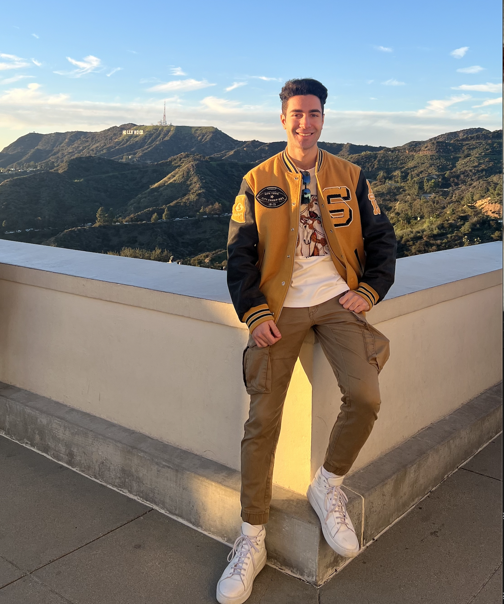

---
format:
  html:
    toc: false
---
::: {.home-shell .fade-up .fade-delay-1 style="width:100%; max-width:100%;"}
# Alexandros Karagiannis - Αλέξανδρος Καραγιάννης
## Statistical Analysis Portfolio
::: {style="margin-top:-6px; margin-bottom:14px; font-size:1.18rem; font-weight:600; color:#6b7280;"}
Applied Statistician specializing in Data Analysis & Visualization
:::
::: {style="margin-top:10px; margin-bottom:18px; font-size:1.13rem;"}
<strong>Alma mater:</strong> <a href="https://www.utoronto.ca" target="_blank" rel="noopener noreferrer">University of Toronto</a> · <a href="https://www.doukas.edu.gr/diethni-programmata/ib-diploma-programme/" target="_blank" rel="noopener noreferrer">Doukas School IB Department, Athens, Greece</a>
:::

::: {style="position:relative; overflow:hidden;"}
<canvas id="home-bg-canvas" style="position:absolute;top:0;left:0;width:100%;height:100%;z-index:0;pointer-events:none;"></canvas>

::: {style="position:relative;z-index:1;"}
::: home-blue-panel
::: columns
::: {.column width="40%"}
::: {.fade-up .fade-delay-2}
{style="width:100%; max-width:360px; height:430px; object-fit:cover; border-radius:20px; display:block; margin:auto;"}
:::
:::
::: {.column width="60%"}
::: {.fade-up .fade-delay-3}

Welcome to my website.

I am a University of Toronto graduate with a degree in Applied Statistics, Economics, and Politics. I am interested in data science and the application of statistical reasoning to real-world scenarios.

This portfolio brings together selected academic work in order to show both my technical skills and my broader interest in using quantitative methods.
:::
::: {.home-quote-box .fade-up .fade-delay-4}
> **Ζητεῖν τὴν ἀλήθειαν**\
> *To seek the truth.*\
> This idea reflects the motivation behind my work: to move beyond surface-level numbers, understand the deeper story data can tell, and apply statistical reasoning thoughtfully in order to reach meaningful judgments.
:::
::: {.fade-up .fade-delay-5 style="margin-top: 1rem;"}
[View My Projects](projects.qmd){.btn .btn-primary .home-project-btn}
:::
::: {.social-icons .fade-up .fade-delay-5 style="margin-top:18px;"}
[](https://github.com/Alexander71747){target="_blank"} [](https://www.linkedin.com/in/alexandros-karagiannis-340739263/){target="_blank"}
:::
:::
:::
:::
:::
:::
:::

```{=html}
<script>
(function(){
  const panel = document.querySelector('.home-blue-panel');
  if (!panel) return;

  panel.style.position = 'relative';
  panel.style.overflow = 'hidden';

  const canvas = document.createElement('canvas');
  canvas.style.cssText = 'position:absolute;top:0;left:0;width:100%;height:100%;z-index:0;pointer-events:none;';
  panel.insertBefore(canvas, panel.firstChild);

  const inner = panel.querySelector('.columns');
  if (inner) inner.style.position = 'relative', inner.style.zIndex = '1';

  const ctx = canvas.getContext('2d');
  let W, H, t = 0;

  function resize(){
    W = canvas.width = panel.offsetWidth;
    H = canvas.height = panel.offsetHeight;
  }
  resize();
  window.addEventListener('resize', resize);

  const waves = [
    { amp:0.18, speed:0.002, phase:0.0,  r:90,  g:120, b:200 },
    { amp:0.14, speed:0.003, phase:2.1,  r:70,  g:100, b:210 },
    { amp:0.22, speed:0.0015,phase:4.4,  r:110, g:90,  b:195 },
    { amp:0.12, speed:0.004, phase:1.0,  r:100, g:130, b:180 },
    { amp:0.17, speed:0.0025,phase:3.3,  r:80,  g:110, b:200 },
  ];

  function gauss(x, mu, sig){
    return Math.exp(-0.5 * ((x - mu) / sig) ** 2);
  }

  function draw(){
    ctx.clearRect(0, 0, W, H);
    waves.forEach(w => {
      const mu  = 0.5 + Math.sin(t * w.speed + w.phase) * 0.25;
      const sig = 0.18 + Math.cos(t * w.speed * 0.7 + w.phase) * 0.03;
      const baseY = H * 0.6;

      ctx.beginPath();
      for(let px = 0; px <= W; px += 3){
        const nx = px / W;
        const gy = gauss(nx, mu, sig);
        const py = baseY - (gy * H * w.amp * 2.2);
        px === 0 ? ctx.moveTo(px, py) : ctx.lineTo(px, py);
      }
      ctx.strokeStyle = `rgba(${w.r},${w.g},${w.b},0.38)`;
      ctx.lineWidth = 1.8;
      ctx.stroke();

      ctx.beginPath();
      for(let px = 0; px <= W; px += 3){
        const nx = px / W;
        const gy = gauss(nx, mu, sig);
        const py = baseY - (gy * H * w.amp * 2.2);
        px === 0 ? ctx.moveTo(px, py) : ctx.lineTo(px, py);
      }
      ctx.lineTo(W, H);
      ctx.lineTo(0, H);
      ctx.closePath();
      ctx.fillStyle = `rgba(${w.r},${w.g},${w.b},0.10)`;
      ctx.fill();
    });
    t++;
    requestAnimationFrame(draw);
  }

  draw();
})();
</script>
```