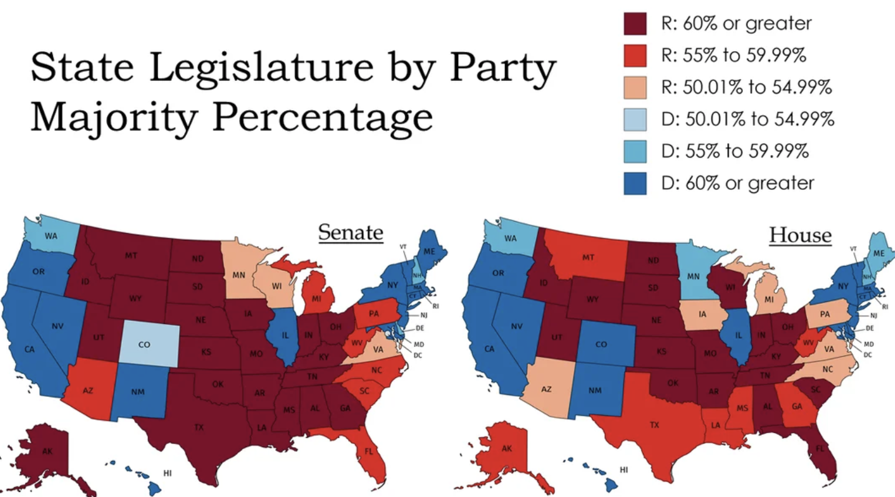

## Selected Projects

::: grid
::: {.g-col-12 .g-col-md-6}
::: {.project-card .fade-up .fade-delay-1}

### Survival Analysis of AML Patients

Cox proportional hazards modeling of remission duration in AML patients, with interpretation of hazard ratios and treatment effects.

**Tools:** R, survival analysis, Cox model

[View Project](survival_analysis.html)
:::
:::

::: {.g-col-12 .g-col-md-6}
::: {.project-card .fade-up .fade-delay-2}

### Regression and Logistic Modeling in R

Applied linear regression to model the relationship between roller weight and lawn depression, and used logistic regression to analyze how dilution affects seed germination probabilities.

**Tools:** R, linear regression, logistic regression, prediction intervals, data visualization

[View Project](regression-logistic-modeling.html)
:::
:::

::: {.g-col-12 .g-col-md-6}
::: {.project-card .fade-up .fade-delay-3}

### Ordinal Logistic Regression on SOPA Support

Used ordinal logistic regression to model legislators’ stance on the Stop Online Piracy Act as a function of party affiliation and campaign contributions.

**Tools:** R, ordinal logistic regression, predicted probabilities, model comparison

[View Project](ordinal-logistic-piracy.html)
:::
:::

::: {.g-col-12 .g-col-md-6}
::: {.project-card .fade-up .fade-delay-4}

### Multinomial Election and Snowfall Timing Analysis

Used multinomial logistic regression to model candidate vote probabilities in Chicago precincts and analyzed the timing of snowfall events in Halifax.

**Tools:** R, multinomial logistic regression, grouped summaries, probability modeling

[View Project](multinomial-election-analysis.html)
:::
:::

::: {.g-col-12 .g-col-md-6}
::: {.project-card .fade-up .fade-delay-5}

### Two-Way ANOVA in R: Teak Growth and Rhizobium Nitrogen Fixation

Two R-based ANOVA studies examining teak tree growth under different planting methods and root lengths, and nitrogen fixation in clover under varying rhizobium strain and culture combinations.

**Tools:** R, two-way ANOVA, interaction plots, simple effects, Tukey HSD

[View Project](Two%20Way%20ANOVA.html)
:::
:::

::: {.g-col-12 .g-col-md-6}
::: {.project-card .fade-up .fade-delay-6}

### Contrasts, Transformation, and MANOVA in R

Three R-based analyses: custom contrasts for age-group comparisons, transformed regression with interaction for onion yield, and MANOVA for wheat grain and straw across field rows and columns.

**Tools:** R, custom contrasts, linear modeling, Box-Cox transformation, interaction analysis, MANOVA, data visualization

[View Project](Contrasts,%20Transformations%20%26%20MANOVA.html)
:::
:::
:::
