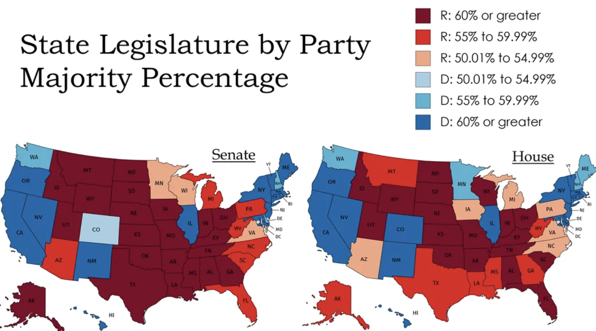
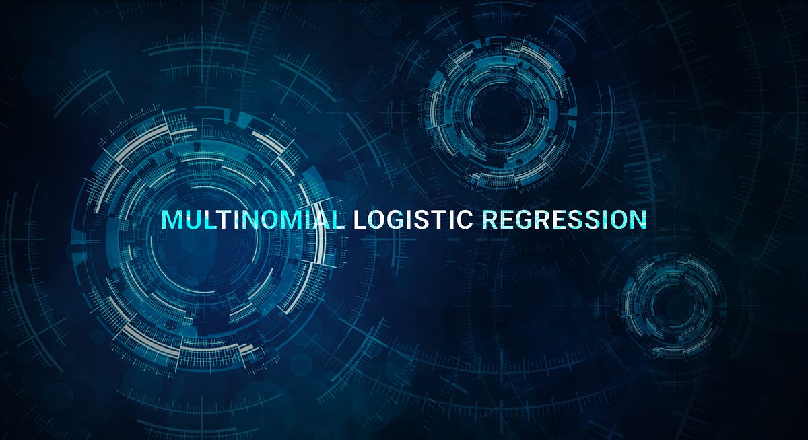
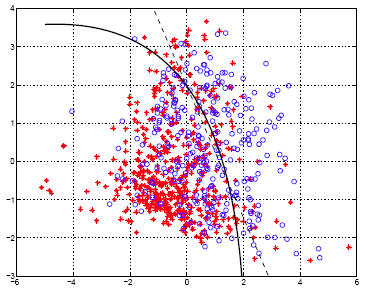

```{=html}
<div id="projects-hero" style="position:relative;width:100%;height:260px;overflow:hidden;">
  <canvas id="star-canvas" style="position:absolute;inset:0;width:100%;height:100%;"></canvas>
  <div style="position:absolute;inset:0;display:flex;flex-direction:column;align-items:center;justify-content:center;pointer-events:none;z-index:2;">
    <h2 style="font-family:Georgia,serif;font-size:40px;font-weight:600;color:#111111;margin:0;letter-spacing:.02em;text-shadow:0 1px 12px rgba(255,255,255,0.95),0 0 30px rgba(255,255,255,0.8);">Selected Projects</h2>
    <p style="font-family:Georgia,serif;font-size:15px;color:#333333;margin:12px 0 0;font-style:italic;letter-spacing:.03em;font-weight:500;text-shadow:0 1px 8px rgba(255,255,255,0.95),0 0 20px rgba(255,255,255,0.8);">A Curated Collection of Statistical Analysis Reports</p>
  </div>
</div>
```

::: grid
::: {.g-col-12 .g-col-md-6}
::: {.project-card .fade-up .fade-delay-1}
{.project-img-wide}

### Survival Analysis of AML (Acute Myeloid Leukemia) Patients

Cox proportional hazards modeling of remission duration in AML patients, with interpretation of hazard ratios and treatment effects.

**Tools:** R, survival analysis, Cox model

[View Project](survival_analysis.html)
:::
:::

::: {.g-col-12 .g-col-md-6}
::: {.project-card .fade-up .fade-delay-2}
{.project-img-wide}

### Regression and Logistic Modeling in R

Applied linear regression to model the relationship between roller weight and lawn depression, and used logistic regression to analyze how dilution affects seed germination probabilities.

**Tools:** R, linear regression, logistic regression, prediction intervals, data visualization

[View Project](regression-logistic-modeling.html)
:::
:::

::: {.g-col-12 .g-col-md-6}
::: {.project-card .fade-up .fade-delay-3}
{.project-img-wide}

### Ordinal Logistic Regression on SOPA Support

Used ordinal logistic regression to model legislators' stance on the Stop Online Piracy Act as a function of party affiliation and campaign contributions.

**Tools:** R, ordinal logistic regression, predicted probabilities, model comparison

[View Project](ordinal-logistic-piracy.html)
:::
:::

::: {.g-col-12 .g-col-md-6}
::: {.project-card .fade-up .fade-delay-4}
{.project-img-wide}

### Multinomial Election and Snowfall Timing Analysis

Used multinomial logistic regression to model candidate vote probabilities in Chicago precincts and analyzed the timing of snowfall events in Halifax.

**Tools:** R, multinomial logistic regression, grouped summaries, probability modeling

[View Project](multinomial-election-analysis.html)
:::
:::

::: {.g-col-12 .g-col-md-6}
::: {.project-card .fade-up .fade-delay-5}
{.project-img-wide}

### Two-Way ANOVA in R: Teak Growth and Rhizobium Nitrogen Fixation

Two R-based ANOVA studies examining teak tree growth under different planting methods and root lengths, and nitrogen fixation in clover under varying rhizobium strain and culture combinations.

**Tools:** R, two-way ANOVA, interaction plots, simple effects, Tukey HSD

[View Project](Two%20Way%20ANOVA.html)
:::
:::

::: {.g-col-12 .g-col-md-6}
::: {.project-card .fade-up .fade-delay-6}
{.project-img-wide}

### Contrasts, Transformation, and MANOVA in R

Three R-based analyses: custom contrasts for age-group comparisons, transformed regression with interaction for onion yield, and MANOVA for wheat grain and straw across field rows and columns.

**Tools:** R, custom contrasts, linear modeling, Box-Cox transformation, interaction analysis, MANOVA, data visualization

[View Project](Contrasts,%20Transformations%20%26%20MANOVA.html)
:::
:::

::: {.g-col-12 .g-col-md-6}
::: {.project-card .fade-up .fade-delay-7}
{.project-img-wide}

### Repeated Measures, MANOVA, and Discriminant Analysis in R

This project combines repeated-measures and multivariate statistical analysis in R. It examines changes in self-esteem across treatment groups over time and uses MANOVA and discriminant analysis to distinguish rainforest leaves from different regions based on multiple shape measurements.

**Tools:** R, repeated-measures MANOVA, mixed-effects model, MANOVA, discriminant analysis

[View Project](repeated-measures-manova-discriminant-analysis.html)
:::
:::

::: {.g-col-12 .g-col-md-6}
::: {.project-card .fade-up .fade-delay-8}
{.project-img-wide}

### Python Learning Platform with Profiles, Quizzes, and Progress Tracking

A menu-based Python educational application that allows users to create secure profiles, log in, open lesson PDFs, complete quizzes, and track interactive learning progress.

**Tools:** Python, csv, os, subprocess, platform, bcrypt, matplotlib

[View Project](python-learning-platform.html)
:::
:::

::: {.g-col-12 .g-col-md-6}
::: {.project-card .fade-up .fade-delay-9}
{.project-img-wide}

### Canadian Mortgage Loan Value Analysis

Analysis of how average new mortgage loan values changed across Canada, provinces, and selected metropolitan areas from 2012 Q3 to 2025 Q4, using descriptive statistics, hypothesis testing, bootstrapping, and regression modelling to examine the effects of time and geography.

**Tools:** R, readxl, tidyverse, dplyr, tidyr, lubridate, janitor, ggplot2, confidence intervals, Welch two-sample t-test, bootstrap resampling, linear regression, interaction regression, cross-validation

[View Project](mortgage_canada_data.html)
:::
:::

::: {.g-col-12 .g-col-md-6}
::: {.project-card .fade-up .fade-delay-10}
{.project-img-wide}

### Cluster Analysis of Amino Acid Sequencing and Exoplanets

Clustering analysis of vertebrate genetic distances and exoplanet characteristics using hierarchical clustering with Ward's method, dendrogram interpretation, z-score standardization, scree plots, and K-means cluster comparison.

**Tools:** R, tidyverse, dplyr, tidyr, readr, hclust, Ward's method, dendrograms, rect.hclust, dist objects, scale, K-means clustering, set.seed, nstart, scree plot, within-cluster sum of squares

[View Project](amino_acid_exoplanet_analysis.html)
:::
:::
:::

```{=html}
<script>
(function () {
  const canvas = document.getElementById('star-canvas');
  const ctx = canvas.getContext('2d');
  let W, H, nodes, rings, frame = 0;

  function resize() {
    W = canvas.width = canvas.offsetWidth;
    H = canvas.height = canvas.offsetHeight;
    init();
  }

  const N = 72;
  const CONNECT_DIST = 140;
  const PULSE_INTERVAL = 80;

  function gaussRand() {
    let u = 0, v = 0;
    while (u === 0) u = Math.random();
    while (v === 0) v = Math.random();
    return Math.sqrt(-2 * Math.log(u)) * Math.cos(2 * Math.PI * v);
  }

  const clusterColors = [
    { r: 80,  g: 60,  b: 200 },
    { r: 40,  g: 100, b: 210 },
    { r: 120, g: 120, b: 140 },
  ];

  function init() {
    rings = [];
    nodes = Array.from({ length: N }, (_, i) => {
      const cluster = i % 3;
      const cx = [W * .20, W * .52, W * .80][cluster];
      const cy = [H * .52, H * .42, H * .56][cluster];
      const spread = [W * .11, W * .13, W * .10][cluster];
      return {
        x: cx + gaussRand() * spread,
        y: cy + gaussRand() * spread * 0.6,
        vx: (Math.random() - .5) * 0.22,
        vy: (Math.random() - .5) * 0.14,
        r: 1.8 + Math.random() * 2.8,
        baseAlpha: 0.45 + Math.random() * 0.45,
        pulse: 0,
        breathOffset: Math.random() * Math.PI * 2,
        breathSpeed: 0.016 + Math.random() * 0.014,
        cluster
      };
    });
  }

  function spawnRing(x, y, col) {
    rings.push({ x, y, col, r: 4, maxR: 60 + Math.random() * 40, alpha: 0.6, speed: 0.9 + Math.random() * 0.6 });
  }

  function drawRings() {
    rings = rings.filter(rg => rg.alpha > 0.01);
    rings.forEach(rg => {
      ctx.beginPath();
      ctx.arc(rg.x, rg.y, rg.r, 0, Math.PI * 2);
      ctx.strokeStyle = `rgba(${rg.col.r},${rg.col.g},${rg.col.b},${rg.alpha.toFixed(3)})`;
      ctx.lineWidth = 1.2;
      ctx.stroke();
      rg.r += rg.speed;
      rg.alpha *= 0.94;
    });
  }

  function drawFlow() {
    const t = frame * 0.008;
    for (let x = 0; x < W; x += 28) {
      for (let y = 0; y < H; y += 28) {
        const angle = Math.sin(x * 0.012 + t) * Math.cos(y * 0.012 + t * 0.7) * Math.PI * 2;
        const len = 7;
        const ax = x + Math.cos(angle) * len * 0.5;
        const ay = y + Math.sin(angle) * len * 0.5;
        ctx.beginPath();
        ctx.moveTo(ax - Math.cos(angle) * len * 0.5, ay - Math.sin(angle) * len * 0.5);
        ctx.lineTo(ax + Math.cos(angle) * len * 0.5, ay + Math.sin(angle) * len * 0.5);
        ctx.strokeStyle = `rgba(100,110,180,0.07)`;
        ctx.lineWidth = 0.8;
        ctx.stroke();
      }
    }
  }

  function draw() {
    ctx.clearRect(0, 0, W, H);

    drawFlow();
    drawRings();

    if (frame % PULSE_INTERVAL === 0) {
      const src = nodes[Math.floor(Math.random() * N)];
      src.pulse = 1;
      spawnRing(src.x, src.y, clusterColors[src.cluster]);
      setTimeout(() => spawnRing(src.x, src.y, clusterColors[src.cluster]), 180);
    }

    for (let i = 0; i < N; i++) {
      const a = nodes[i];
      for (let j = i + 1; j < N; j++) {
        const b = nodes[j];
        const dx = a.x - b.x, dy = a.y - b.y;
        const d = Math.sqrt(dx * dx + dy * dy);
        if (d < CONNECT_DIST) {
          const strength = 1 - d / CONNECT_DIST;
          const pulseBoost = Math.max(a.pulse, b.pulse);
          const ca = clusterColors[a.cluster];
          const cb = clusterColors[b.cluster];
          const mr = Math.round((ca.r + cb.r) / 2);
          const mg = Math.round((ca.g + cb.g) / 2);
          const mb = Math.round((ca.b + cb.b) / 2);
          ctx.beginPath();
          ctx.moveTo(a.x, a.y);
          ctx.lineTo(b.x, b.y);
          ctx.strokeStyle = `rgba(${mr},${mg},${mb},${(strength * 0.22 + pulseBoost * 0.5).toFixed(3)})`;
          ctx.lineWidth = 0.4 + strength * 1.4 + pulseBoost * 1.8;
          ctx.stroke();
        }
      }
    }

    nodes.forEach(n => {
      const col = clusterColors[n.cluster];
      const breathe = 0.82 + 0.18 * Math.sin(frame * n.breathSpeed + n.breathOffset);
      const a = Math.min(1, n.baseAlpha * breathe + n.pulse * 0.5);
      const radius = (n.r + n.pulse * 4) * breathe;

      ctx.beginPath();
      ctx.arc(n.x, n.y, radius, 0, Math.PI * 2);
      ctx.fillStyle = `rgba(${col.r},${col.g},${col.b},${a.toFixed(3)})`;
      ctx.fill();

      ctx.beginPath();
      ctx.arc(n.x, n.y, radius + 2, 0, Math.PI * 2);
      ctx.strokeStyle = `rgba(${col.r},${col.g},${col.b},${(a * 0.3).toFixed(3)})`;
      ctx.lineWidth = 1;
      ctx.stroke();

      if (n.pulse > 0.01) {
        n.pulse = Math.max(0, n.pulse - 0.02);
      }

      n.x += n.vx;
      n.y += n.vy;
      const pad = 24;
      if (n.x < pad || n.x > W - pad) n.vx *= -1;
      if (n.y < pad || n.y > H - pad) n.vy *= -1;
      n.x = Math.max(pad, Math.min(W - pad, n.x));
      n.y = Math.max(pad, Math.min(H - pad, n.y));
    });

    frame++;
    requestAnimationFrame(draw);
  }

  resize();
  draw();
  window.addEventListener('resize', resize);
})();
</script>
```